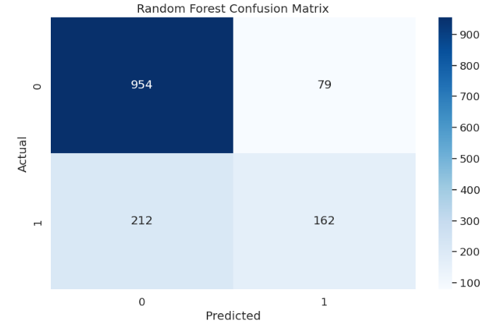
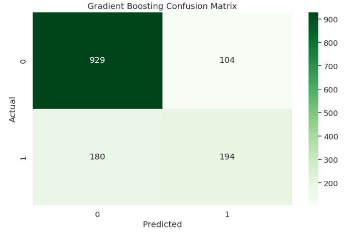
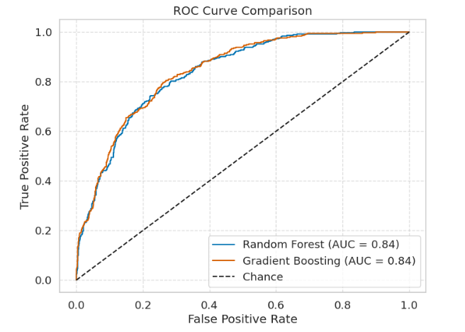

# Predicting Telco Customer Churn Using Random Forest and Gradient Boosting

[](https://www.python.org/)
[](https://scikit-learn.org/stable/)
[](https://seaborn.pydata.org/)
[](./LICENSE)
[](https://jupyter.org/)
[](https://www.kaggle.com/code/evangelosgakias/randomforest-gradientboosting)
[](https://www.kaggle.com/code/evangelosgakias/randomforest-gradientboosting)

---

## 🚀 Live Results

You can view the notebook with all outputs and results on Kaggle:
[https://www.kaggle.com/code/evangelosgakias/randomforest-gradientboosting](https://www.kaggle.com/code/evangelosgakias/randomforest-gradientboosting)

All metrics, plots, and outputs are available in the linked Kaggle notebook for full transparency and reproducibility.

---

## 📑 Table of Contents
- [Live Results](#-live-results)
- [Table of Contents](#-table-of-contents)
- [Overview](#-overview)
- [Project Structure](#-project-structure)
- [Features](#-features)
- [Quickstart](#-quickstart)
- [Usage](#-usage)
- [Results](#-results)
- [Limitations and Future Work](#-limitations-and-future-work)
- [Contributing](#-contributing)
- [License](#-license)
- [Contact](#-contact)

---

## 📝 Overview

This project presents a comprehensive machine learning workflow for predicting Telco customer churn using **Random Forest** and **Gradient Boosting** ensemble methods. The notebook demonstrates:
- End-to-end data science best practices (EDA, preprocessing, modeling, evaluation, and interpretation)
- Hyperparameter tuning and model analysis
- Professional documentation, accessibility, and reproducibility standards

**Goal:** Predict whether a customer will churn based on demographic, account, and service features.

---

## 🏗️ Project Structure
```
Random Forests & Gradient Boosting/
├── RandomForest_GradientBoosting.ipynb   # Jupyter notebook with the complete implementation
├── README.md                            # Project documentation (this file)
├── requirements.txt                     # Python dependencies
├── LICENSE                              # MIT License file
├── figure/                              # Visual results (confusion matrices and ROC curves for both models)
│   ├── random_forest_confusion_matrix.png
│   ├── gradient_boosting_confusion_matrix.png
│   ├── roc_curve_comparison.png
```

---

## 🚀 Features

### Data Preparation
- **Dataset Loading:** Uses the Telco Customer Churn dataset ([Hugging Face link](https://huggingface.co/KawgKawgKawg/Telephone-Company-Churn-Classification-Model/raw/main/Telco-Customer-Churn.csv))
- **Exploratory Data Analysis (EDA):** Statistical summaries, class distribution, and visualizations (countplots, histograms)
- **Preprocessing:**
  - Feature scaling (StandardScaler)
  - One-hot encoding for categorical variables
  - Train/test split (80%/20%, stratified)

### Modeling
- **Random Forest Classifier:**
  - Scikit-learn implementation
  - Hyperparameter tuning (n_estimators, max_depth) via GridSearchCV
- **Gradient Boosting Classifier:**
  - Scikit-learn implementation
  - Hyperparameter tuning (n_estimators, learning_rate, max_depth) via GridSearchCV
- **Pipeline:** Combines scaling and modeling for reproducibility

### Evaluation & Interpretation
- **Metrics:** Accuracy, Precision, Recall, F1-score, ROC-AUC, Confusion Matrix
- **Cross-Validation:** 3-fold cross-validation for model stability
- **Visualization:**
  - Confusion matrices
  - ROC curves
  - Feature importance plots
  - SHAP summary plots for interpretability

---

## ⚡ Quickstart

1. **Kaggle (Recommended for Reproducibility):**
   - [Run the notebook on Kaggle](https://www.kaggle.com/code/evangelosgakias/randomforest-gradientboosting)
2. **Local:**
   - Clone the repo and run `RandomForest_GradientBoosting.ipynb` in Jupyter after installing requirements.

---

## 💻 Usage

1. **📥 Clone the repository:**
   ```bash
   git clone https://github.com/EvanGks/random-forests-gradient-boosting.git
   cd random-forests-gradient-boosting
   ```
2. **🔒 Create and activate a virtual environment:**
   - **Windows:**
     ```bash
     python -m venv .venv
     .venv\Scripts\activate
     ```
   - **macOS/Linux:**
     ```bash
     python3 -m venv .venv
     source .venv/bin/activate
     ```
3. **📦 Install dependencies:**
   ```bash
   pip install -r requirements.txt
   ```
4. **🚀 Launch Jupyter Notebook:**
   ```bash
   jupyter notebook RandomForest_GradientBoosting.ipynb
   ```
5. **▶️ Run all cells** to reproduce the analysis and results.

**🛠️ Troubleshooting:**
- If you encounter missing package errors, ensure your Python environment is activated and up to date.

---

## 📊 Results

### Model Metrics (Reproducible Run)

#### Random Forest
- **Best parameters:** `{ 'max_depth': 5, 'n_estimators': 300 }`
- **Evaluation Metrics:**
  - Accuracy: 0.7932
  - Precision: 0.6722
  - Recall: 0.4332
  - F1 Score: 0.5268
  - ROC-AUC: 0.8370

- **Classification Report:**
```
              precision    recall  f1-score   support

           0       0.82      0.92      0.87      1033
           1       0.67      0.43      0.53       374

    accuracy                           0.79      1407
   macro avg       0.75      0.68      0.70      1407
weighted avg       0.78      0.79      0.78      1407
```

#### Gradient Boosting
- **Best parameters:** `{ 'learning_rate': 0.1, 'max_depth': 3, 'n_estimators': 50 }`
- **Evaluation Metrics:**
  - Accuracy: 0.7982
  - Precision: 0.6510
  - Recall: 0.5187
  - F1 Score: 0.5774
  - ROC-AUC: 0.8417

- **Classification Report:**
```
              precision    recall  f1-score   support

           0       0.84      0.90      0.87      1033
           1       0.65      0.52      0.58       374

    accuracy                           0.80      1407
   macro avg       0.74      0.71      0.72      1407
weighted avg       0.79      0.80      0.79      1407
```

#### Model Comparison Table

| Model              | Accuracy | Precision | Recall   | F1 Score | ROC-AUC |
|--------------------|----------|-----------|----------|----------|---------|
| Random Forest      | 0.793177 | 0.672199  | 0.433155 | 0.526829 | 0.836961|
| Gradient Boosting  | 0.798152 | 0.651007  | 0.518717 | 0.577381 | 0.841749|

#### Visualizations
- **Confusion Matrices:**
  - Random Forest: 
  - Gradient Boosting: 
- **ROC Curve Comparison:**
  - 
- See the live version of the [notebook](https://www.kaggle.com/code/evangelosgakias/randomforest-gradientboosting) for the top 15 features importance and SHAP analysis.

---

## 📝 Limitations and Future Work

- **Class Imbalance:** The dataset is moderately imbalanced; further techniques (e.g., SMOTE, class weighting) may improve minority class recall.
- **Hyperparameter Tuning:** More extensive grid search or Bayesian optimization could further improve results.
- **Model Extensions:** Try additional ensemble methods or deep learning approaches.
- **Deployment:** Integrate the model into a real-time pipeline for business use.

---

## 🤝 Contributing

Contributions are welcome! Please feel free to submit a Pull Request. For major changes, open an issue first to discuss what you would like to change.

---

## 📝 License

This project is licensed under the MIT License. See the [LICENSE](./LICENSE) file for details.

---

## 📬 Contact

For questions or feedback, please reach out via:
- **GitHub:** [EvanGks](https://github.com/EvanGks)
- **X (Twitter):** [@Evan6471133782](https://x.com/Evan6471133782)
- **LinkedIn:** [Evangelos Gakias](https://www.linkedin.com/in/evangelos-gakias-346a9072)
- **Kaggle:** [evangelosgakias](https://www.kaggle.com/evangelosgakias)
- **Email:** [evangks88@gmail.com](mailto:evangks88@gmail.com)

---

Happy Coding! 🚀
